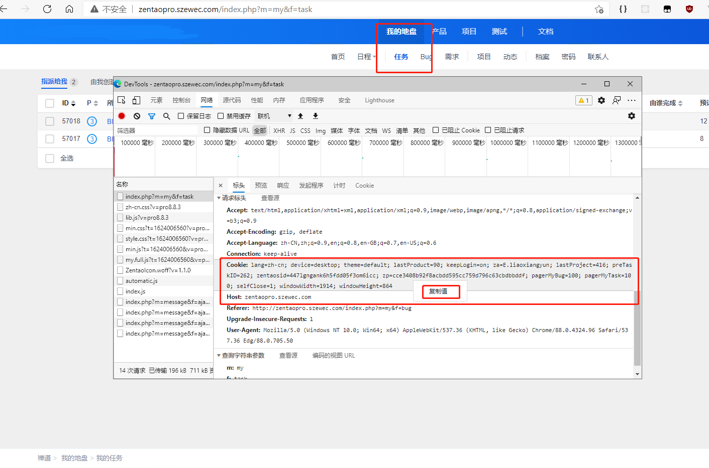
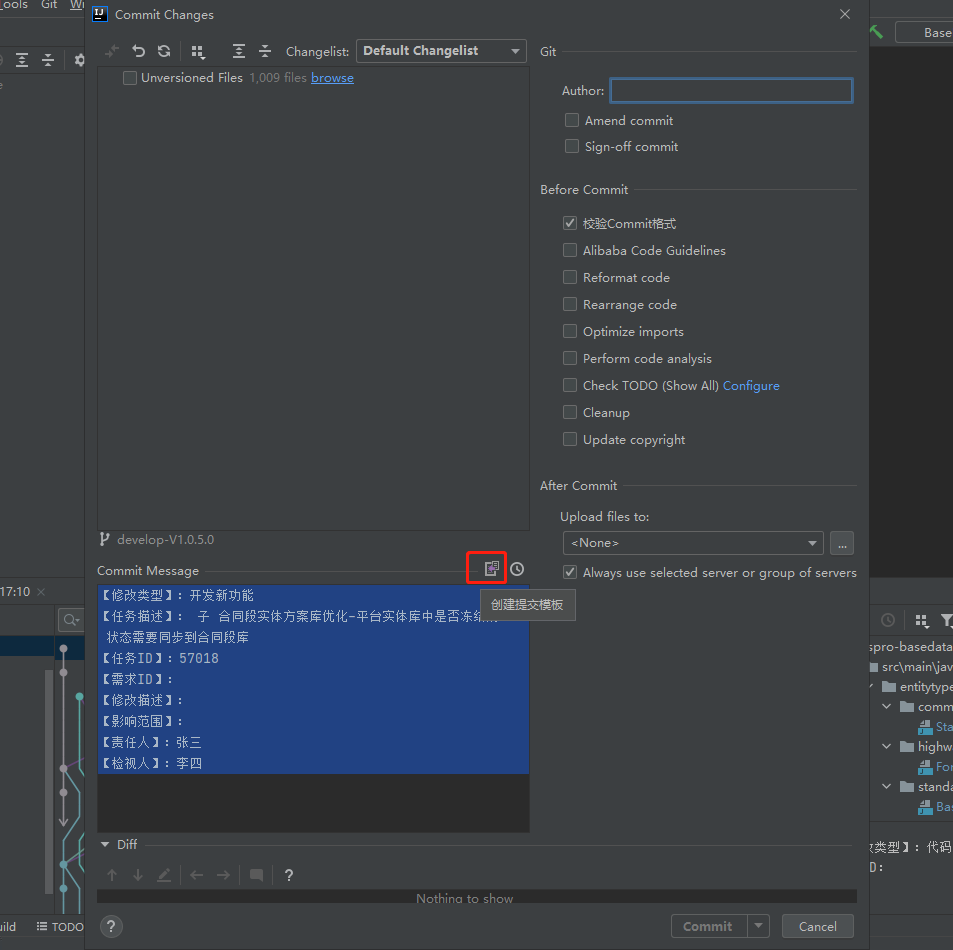
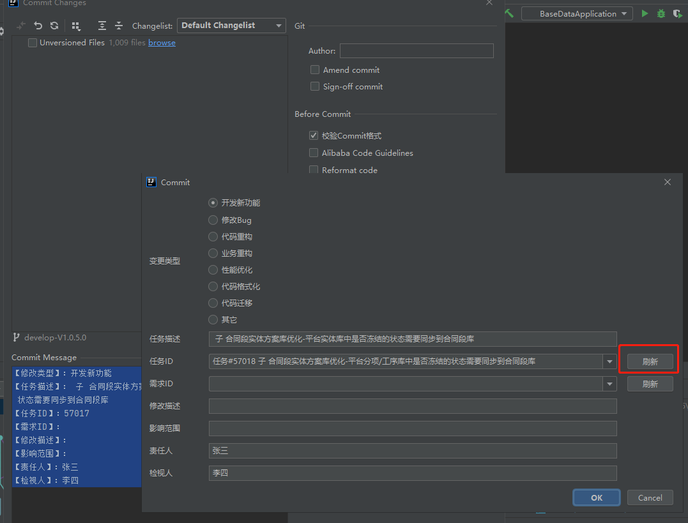

# liaoxy-idea-helper

## Todo List

- [x] Git commit template
- [ ] task2

<!-- Plugin description -->
liaoxy helper 
This plug-in integrates various customized functions 
At present, it has achieved the following goals: 
【Git commit template】 
This plugin allows to create a commit message with the following template: 
【label1】: describe 
【label2】: describe 
... 
Various functions will be updated later ...   
<!-- Plugin description end -->

## Installation

- Using IDE built-in plugin system:

  <kbd>Settings/Preferences</kbd> > <kbd>Plugins</kbd> > <kbd>Marketplace</kbd> > <kbd>Search for "
  liaoxy-helper"</kbd> >
  <kbd>Install Plugin</kbd>

- Manually:

  Download the [latest release](https://github.com/liaoxiangyun/liaoxy-idea-helper/releases/latest) and install it
  manually using
  <kbd>Settings/Preferences</kbd> > <kbd>Plugins</kbd> > <kbd>⚙️</kbd> > <kbd>Install plugin from disk...</kbd>

---
Plugin based on the [IntelliJ Platform Plugin Template][template].

[template]: https://github.com/JetBrains/intellij-platform-plugin-template

## Usage

